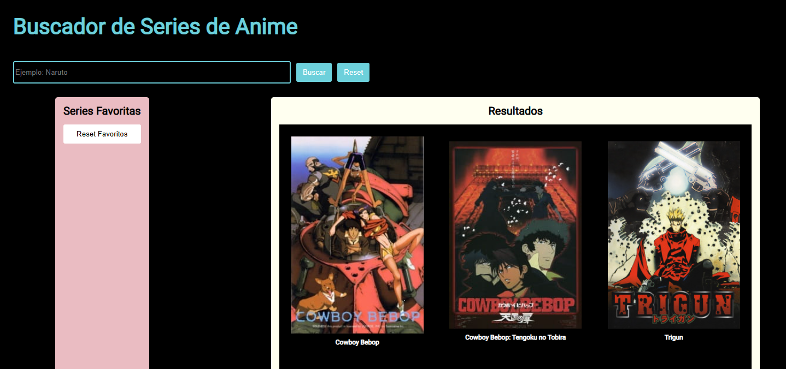
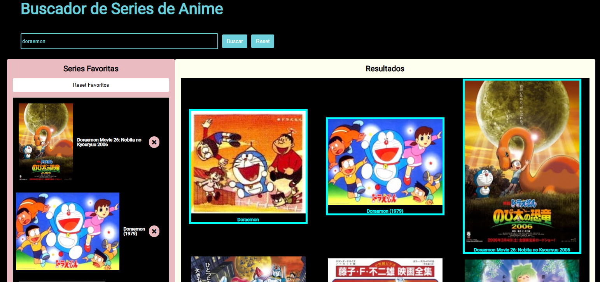

![Tania Salvatella - Exam Module 2]

Este es el proyecto presentado para el examen del Módulo 1. He utlizado un template para poder trabajar con **node y vite**. Son unas **plantilla de proyecto con funcionalidades preinstaladas y preconfiguradas**.

Para realizar este proyecto he usado un motor de plantillas HTML, el preprocesador SASS que automatiza tareas.

# Buscador de Series de Anime

Este proyecto es un buscador de series de anime que permite a los usuarios buscar información sobre animes utilizando la API de Jikan y guardar sus series favoritas.

Aquí hay una captura de pantalla de la interfaz:



Y aquí un ejemplo de uso:



## Características

*   **Búsqueda de anime:** Los usuarios pueden buscar animes por título utilizando un campo de texto.
*   **Visualización de resultados:** Los resultados de la búsqueda se muestran en una lista, incluyendo la imagen y el título del anime.
*   **Gestión de favoritos:** Los usuarios pueden añadir y eliminar animes de su lista de favoritos.
*   **Persistencia de datos:** Las series favoritas se guardan en el almacenamiento local del navegador (`localStorage`), lo que permite que se conserven entre sesiones.
*   **Interfaz dinámica:** La interfaz se actualiza dinámicamente al realizar búsquedas y al gestionar los favoritos.

## Tecnologías utilizadas

*   HTML
*   CSS
*   JavaScript
*   API de Jikan (https://jikan.moe/)

## Cómo utilizar

1.  Abre el archivo `index.html` en tu navegador.
2.  Introduce un término de búsqueda en el campo de texto.
3.  Haz clic en el botón "Buscar".
4.  Los resultados de la búsqueda se mostrarán en la columna "Resultados".
5.  Haz clic en una serie en la columna "Resultados" para añadirla a "Series Favoritas" (aparecerá un borde azul alrededor de la serie en "Resultados").
6.  Para eliminar una serie de "Series Favoritas", haz clic en el botón "X" que aparece junto a la serie en la columna "Series Favoritas".

## Estructura del código

*   `index.html`: Contiene la estructura HTML de la página.
*   `styles.css`: Contiene los estilos CSS.
*   `script.js`: Contiene la lógica JavaScript.

## Funcionalidades principales en `script.js`

*   **`renderSeries(list)`:** Renderiza la lista de series en la columna "Resultados".
*   **`renderFavoritSeries(favorites)`:** Renderiza la lista de series favoritas en la columna "Series Favoritas".
*   **`handleClickFav(ev)`:** Maneja el evento de clic en una serie para añadirla o eliminarla de favoritos.
*   **`handleClickX(ev)`:** Maneja el evento de clic en el botón "X" para eliminar una serie de favoritos.
*   **`listenerSelected()`:** Añade event listeners a las series en la columna "Resultados".
*   **`loadFavorites()`:** Carga las series favoritas desde el almacenamiento local al cargar la página.
*   **`getDataSearch(valueSearch)`:** Realiza la petición a la API de Jikan para buscar animes.
*   **`handleSearch(event)`:** Maneja el evento de clic en el botón de búsqueda.
*   **`loadInitialSeries()`:** Carga una lista inicial de series al cargar la página.

## Mejoras futuras

*   Implementar paginación para mostrar grandes cantidades de resultados.
*   Añadir manejo de errores más robusto.
*   Mejorar la interfaz de usuario.
*   Añadir más detalles de cada anime (sinopsis, género, etc.).
*   Implementar un sistema de búsqueda más avanzado (por género, año, etc.).


En el proyecto hay 3 tipos de ficheros y carpetas:

- Los ficheros que están sueltos en la raíz del repositorio, como vite.config.js, package.json... Son la configuración del proyecto y no necesitamos modificarlos. En el fichero readme describo el proyecto y el fichero `gitignore/` es para poner las carpetas y archivos que no quiero que se suban al repositorio.
- La carpeta `src/`: son los ficheros de nuestra página web, como HTML, CSS, JS...
- La carpeta `public/`, que contiene las imágenes.
- Y la carpeta `docs/`, que es generada automáticamente cuando arrancamos el proyecto. El template lee los ficheros que hay dentro de `src/` y `public/`, los procesa y los genera dentro de `public/` y `docs/`.

## Guía de inicio rápido

> **NOTA:** Necesitas tener instalado [Node JS](https://nodejs.org/) con una versión superior a la 14 para trabajar en este proyecto:

### Pasos a seguir cada vez que queremos arrancar un proyecto desde cero:

1. **Para acceder a este proyecto hay que ir al repositorio en Github.**
1. Clona este **modulo-1-evaluacion-final-TSalvatellaP**
1. **Abre una terminal** en la carpeta raíz de tu repositorio.
1. **Instala las dependencias** locales ejecutando en la terminal el comando:

```bash
npm install
```

### Pasos para arrancar el proyecto:

Una vez hemos instalado las dependencias, vamos a arrancar el proyecto. **El proyecto hay que arrancarlo cada vez que te pongas a programar.** Para ello ejecuta el comando:

```bash
npm start
```

Este comando:

- **Abre una ventana de Chrome y muestra tu página web**, al igual que hace el plugin de VS Code Live Server (Go live).
- También **observa** todos los ficheros que hay dentro de la carpeta `src/`, para que cada vez que modifiques un fichero **refresca tu página en Chrome**.
- También **procesa los ficheros** HTML, SASS / CSS y JS. Por ejemplo:
   - Convierte los ficheros SASS en CSS.
   - Combina los diferentes ficheros de HTML y los agrupa en uno o varios ficheros HTML.

Después de ejecutar `npm start` ya puedes empezar a editar todos los ficheros que están dentro de la carpeta `src/` y programar cómodamente.

### Pasos para control de versiones en el repositorio en GitHub:

Eecuta el comando:

```bash
git add -A
```
```bash
git commit -m "datos-modificacion"
```

```bash
git push
```

Yo he trabajado sobre una rama devloper antes de finalizar todos los cambios en la rama Main.
Para crear una rama donde poder trabajar diferentes versiones sin afectar a las otras ramas:
Ejecuta el comeando:
```bash
git branch nombre-de-la-rama
```
Para pasar de una rama a otra
```bash
git checkout nombre-de-la-rama a la que quieres ir
```
Para comprobar en cuál de las ramas te encuentras
```bash
git branch
```

o

```bash
git status
```

Una vez finalizado el proyecto y todo el trabajo en dev (developer), y subidos todos los cambios(add,commit, push) he pasado todos los cambios a la rama main para subirla a github:
```bash
git checkout main **para movernos a la rama main**
```
```bash
git merge dev **ponemos el nombre de la rama con la queremos hacer  marge, traer todos los cambios**
```

```bash
git add -A
```
```bash
git commit -m "mensaje-commit"
```
```bash
git push
```
Ahora en el repositorio tendríamos actualizada la rama Main y la dev y se publica en Github.git


## Estructura de carpetas

La estructura de carpetas tiene esta proyecto:

```
src
 ├─ images 
 ├─ js // los ficheros de esta carpeta se concatenan en el fichero main.js y este se guarda en public/main.js
 |  ├─ main.js
 |  └─ events.js
 ├─ scss
 |  ├─ core // los ficheros de esta carpeta son los scss que se usan genéricos para todo el proyecto, afecta a todo el proyecto si se enlazan.
 |  └─ layout // los fecharos scss creados por partespara diferenciar las diferentes secciones
 └─ html
    └─ partials // los partials son secciones del index.html para trabajar por partes. Están llamados todos en el index principal
```
